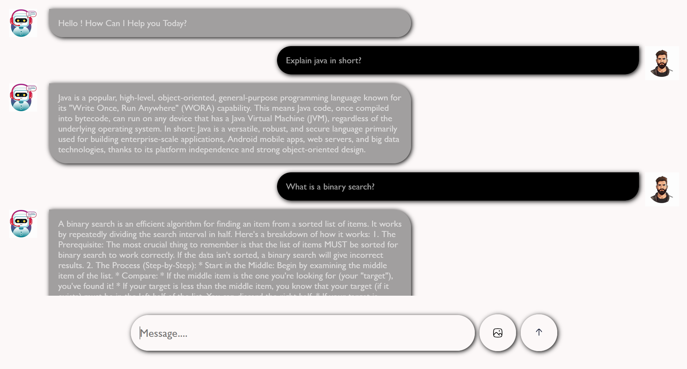

# 🤖 AI Chatbot

A simple and interactive AI Chatbot built using **HTML, CSS, JavaScript, and Google Gemini API**.

## 🌐 Live Demo

[Visit Live AI Chatbot](https://mohitkumar-0001.github.io/Ai-Chatbot/)

## 📸 Project Demo



## ✨ Features

- 🤖 AI-powered chat
- 🖼️ Image upload support
- ⌨️ Send messages using the Enter key
- ⏳ Loading animation
- 📱 Clean and responsive chat interface
- 🔌 Google Gemini API integration

## 🛠️ Technologies Used

- HTML5
- CSS3
- JavaScript
- Google Gemini API

## 📂 Project Structure

```text
Ai-Chatbot/
├── .gitignore
├── index.html
├── style.css
├── script.js
├── ai.jpg
├── user.jpg
├── loading.webp
├── img.svg
├── submit.svg
└── chatbot-demo.png
